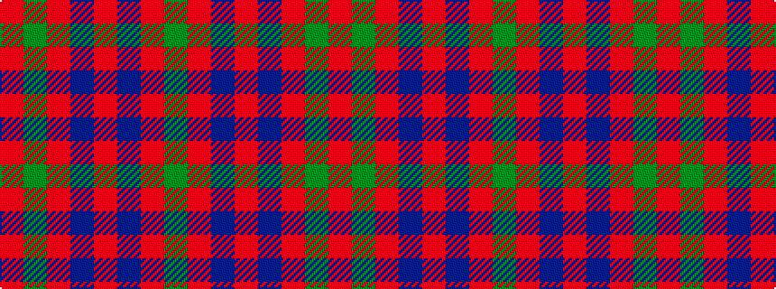

GRBRBRGR

It is a 8 stripe tartan.

<figure class="pat-woven">

<figcaption>idealised sample</figcaption>
</figure>

## Colour Sequence



## Tartans with this colour sequence

| Tartans |
|---------------|
| [Gow](/variants/s8/r4dg4r1db4r4~x12/)|
||
| [Gow (Portrait)](/variants/s8/r5dp5r1g5r5~x8/)|
||
