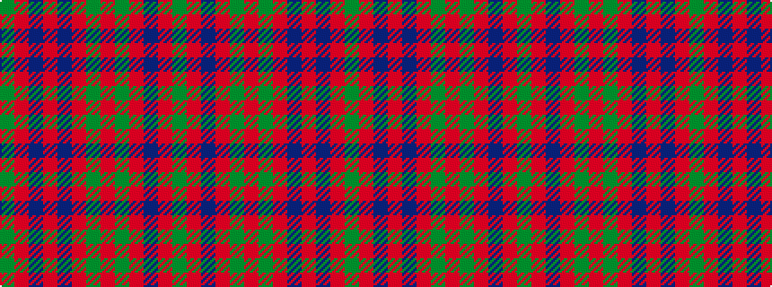

GRBRBRGRGRBRG

It is a 13 stripe tartan.

<figure class="pat-woven">

<figcaption>idealised sample</figcaption>
</figure>

## Colour Sequence



## Tartans with this colour sequence

| Tartans |
|---------------|
| [Fraser, Wedding dress](/setts/g2r3db2r48db60r21g2r21g60r48db2r3g2/)|
||
