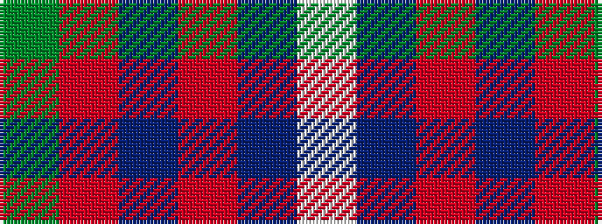

GRBRBW

It is a 6 stripe tartan.

<figure class="pat-woven">

<figcaption>idealised sample</figcaption>
</figure>

## Colour Sequence



## Tartans with this colour sequence

| Tartans |
|---------------|
| [Galloway Red](/setts/s6/g3r2db22r22db2w3~x2/)|
||
| [Galloway, dress](/setts/s6/g1r1db16r16db1w1~x2/)|
||
