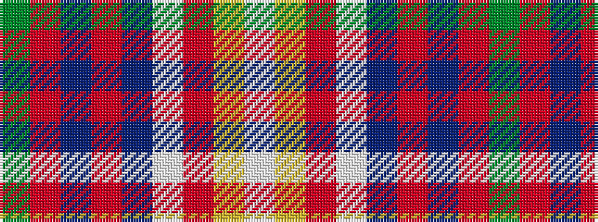

GRBRBWRYW

It is a 9 stripe tartan.

<figure class="pat-woven">

<figcaption>idealised sample</figcaption>
</figure>

## Colour Sequence



## Tartans with this colour sequence

| Tartans |
|---------------|
| [Boucherville Formal District Tartan](/variants/s9/w40ly4o10w8db4o4db4o4g1~x2/)|
||
