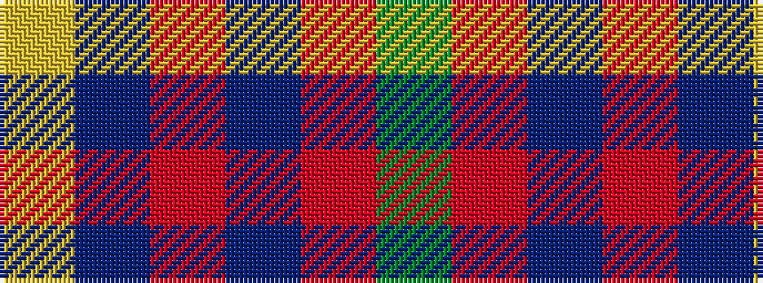

GRBRBY

It is a 6 stripe tartan.

<figure class="pat-woven">

<figcaption>idealised sample</figcaption>
</figure>

## Colour Sequence



## Tartans with this colour sequence

| Tartans |
|---------------|
| [Galloway Dress (Yellow Line)](/setts/s6/dg2r1db16r16db1ly2~x2/)|
||
| [Galloway dress](/setts/s6/g2r1db16r16db1ly2~x2/)|
||
