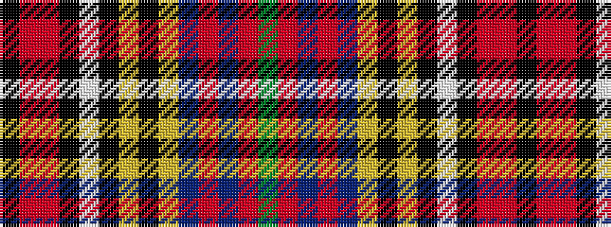

GRBRBYKYKWKRRK

It is a 14 stripe tartan.

<figure class="pat-woven">

<figcaption>idealised sample</figcaption>
</figure>

## Colour Sequence



## Tartans with this colour sequence

| Tartans |
|---------------|
| [Ross Anderson (Fashion) #2](/variants/s14/dg4r2db3r1db3lo1k2lo1k2lb2k2o11r1k1~x4/)|
||
