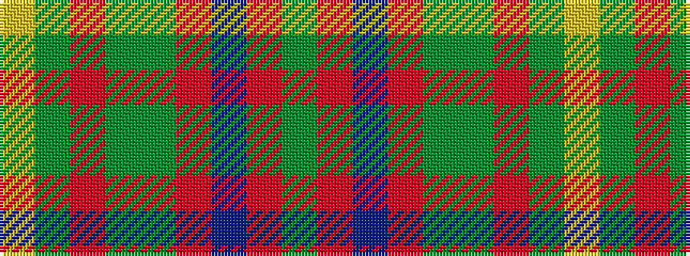

GRBRGGRGY

It is a 9 stripe tartan.

<figure class="pat-woven">

<figcaption>idealised sample</figcaption>
</figure>

## Colour Sequence



## Tartans with this colour sequence

| Tartans |
|---------------|
| [Moncton, City of](/setts/s9/g4r1db2r1g10y5r3y10ly1~x4/)|
||
