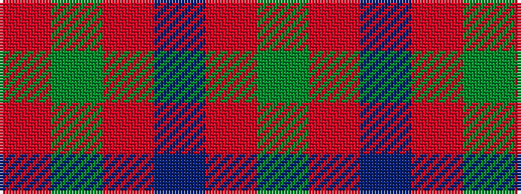

GRBRGR

It is a 6 stripe tartan.

<figure class="pat-woven">

<figcaption>idealised sample</figcaption>
</figure>

## Colour Sequence



## Tartans with this colour sequence

| Tartans |
|---------------|
| [Robertson](/setts/s6/r2dg20r2db8r36dg1~x2/)|
||
| [Robertson 6](/setts/s6/r1g10r1db4r18g1~x4/)|
||
