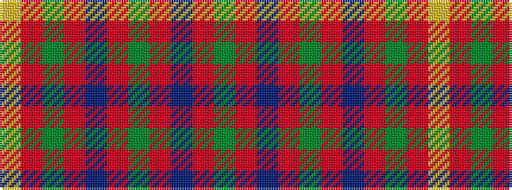

GRBRGRBRGRY

It is a 11 stripe tartan.

<figure class="pat-woven">

<figcaption>idealised sample</figcaption>
</figure>

## Colour Sequence



## Tartans with this colour sequence

| Tartans |
|---------------|
| [Hall](/variants/s11/g4r2db4r2g8r2db4r2g8r2ly1~x3/)|
||
| [Hall (1994)](/variants/s11/g6r3db6r3g12r3db6r3g12r3ly2~x2/)|
||
