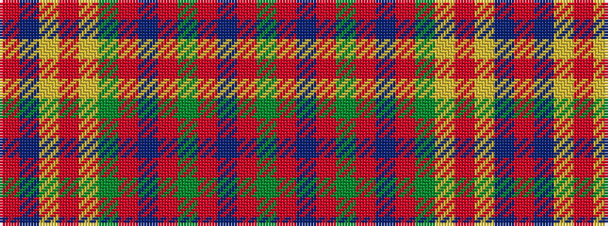

GRBRGRBRGYRYBR

It is a 14 stripe tartan.

<figure class="pat-woven">

<figcaption>idealised sample</figcaption>
</figure>

## Colour Sequence



## Tartans with this colour sequence

| Tartans |
|---------------|
| [Westmeath](/variants/s14/g11r6db6o2g3o2db6r6g36ly2o2ly2db5r5~x2/)|
||
