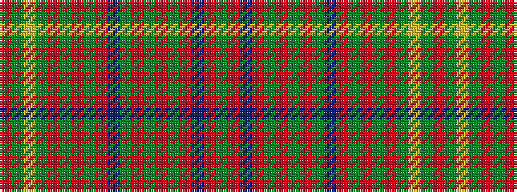

GRBRGRGRGBRGRGRGYGR

It is a 19 stripe tartan.

<figure class="pat-woven">

<figcaption>idealised sample</figcaption>
</figure>

## Colour Sequence



## Tartans with this colour sequence

| Tartans |
|---------------|
| [Brewer](/variants/s19/g3r2b1r19g1r1g1r8g1b8r1g8r1g1r1g28ly1g2m2~x2/)|
||
