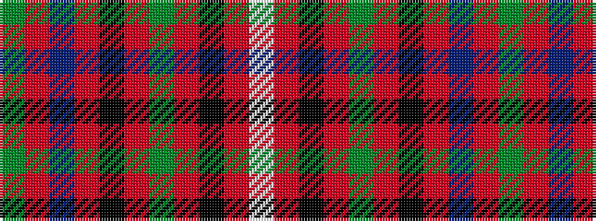

GRBRKRGRKRW

It is a 11 stripe tartan.

<figure class="pat-woven">

<figcaption>idealised sample</figcaption>
</figure>

## Colour Sequence



## Tartans with this colour sequence

| Tartans |
|---------------|
| [Stewart of Rothesay](/setts/s11/g2r26db4r2k4r2g8r4k1r1w2~x2/)|
||
| [Stewart/Stuart of Rothesay (Sobieski)](/setts/s11/dg2r26db4r2k4r2dg8r4k1r1w2~x2/)|
||
