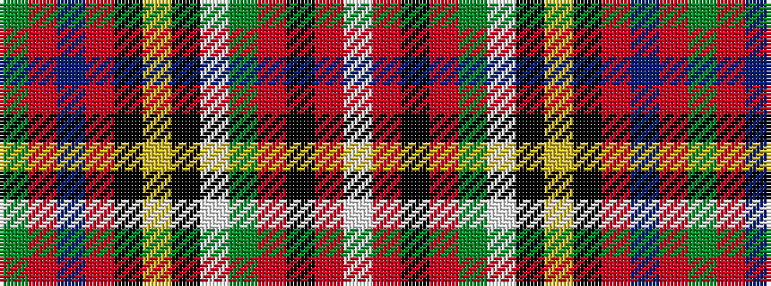

GRBRKYKWGRKRW

It is a 13 stripe tartan.

<figure class="pat-woven">

<figcaption>idealised sample</figcaption>
</figure>

## Colour Sequence



## Tartans with this colour sequence

| Tartans |
|---------------|
| [Stewart of Rothesay](/setts/s13/g7r122db17r12k12ly3k4w3g48r16k4r6w5/)|
||
| [Stuart/Stewart of Rothesay](/setts/s13/dg7r122db17r12k12ly3k4w3dg48r16k4r6w5/)|
||
