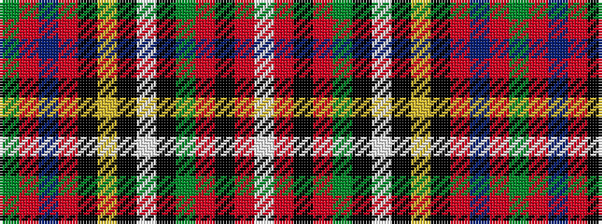

GRBRKYKWKGRKRW

It is a 14 stripe tartan.

<figure class="pat-woven">

<figcaption>idealised sample</figcaption>
</figure>

## Colour Sequence



## Tartans with this colour sequence

| Tartans |
|---------------|
| [Stuart / Stewart](/variants/s14/g2r30db4r4k6ly1k1w1k1g10r4k1r1w1~x2/)|
||
| [Stuart/Stewart](/variants/s14/dg2r30db4r4k6ly1k1w1k1dg10r4k1r1w1~x2/)|
||
