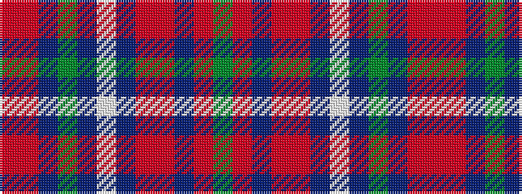

GRBRRBWBGBRR

It is a 12 stripe tartan.

<figure class="pat-woven">

<figcaption>idealised sample</figcaption>
</figure>

## Colour Sequence



## Tartans with this colour sequence

| Tartans |
|---------------|
| [Tyrone](/variants/s12/m50o6dr7g2dr2w2dr2o16m8dr2m9g3~x2/)|
||
