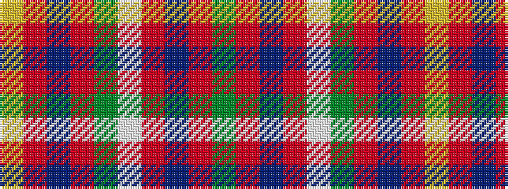

GRBRWGRBRY

It is a 10 stripe tartan.

<figure class="pat-woven">

<figcaption>idealised sample</figcaption>
</figure>

## Colour Sequence



## Tartans with this colour sequence

| Tartans |
|---------------|
| [Loch Linnhe](/setts/s10/g3r6db12r5lt2g10r31db2r4ly3~x2/)|
||
