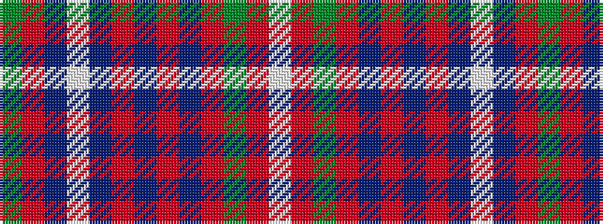

GRBWBRBRBRGRW

It is a 13 stripe tartan.

<figure class="pat-woven">

<figcaption>idealised sample</figcaption>
</figure>

## Colour Sequence



## Tartans with this colour sequence

| Tartans |
|---------------|
| [Largs](/variants/s13/g4r4db44w6db5o4db3o8db3o16g4r22w4/)|
||
