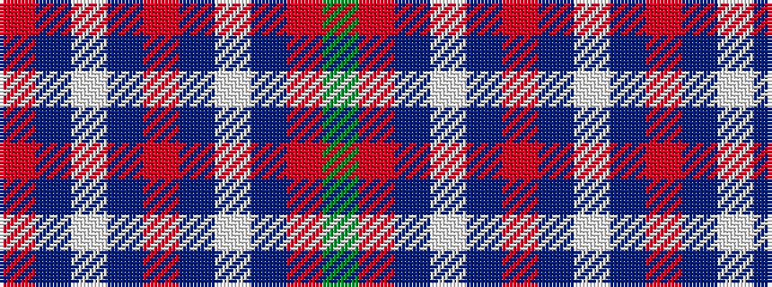

GRBWBRBWBR

It is a 10 stripe tartan.

<figure class="pat-woven">

<figcaption>idealised sample</figcaption>
</figure>

## Colour Sequence



## Tartans with this colour sequence

| Tartans |
|---------------|
| [Galloway (Dance)](/variants/s10/r3b2w35b35r2g3~x2/)|
||
