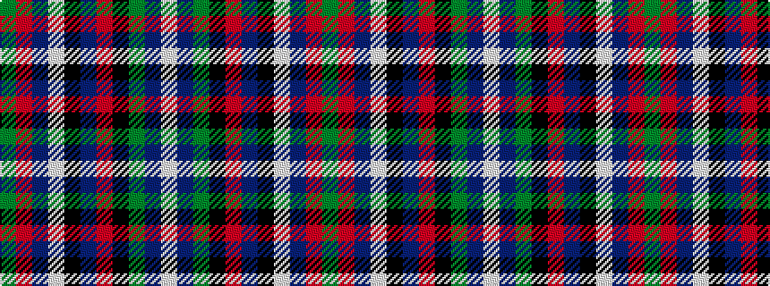

GRBWKBRKGBW

It is a 11 stripe tartan.

<figure class="pat-woven">

<figcaption>idealised sample</figcaption>
</figure>

## Colour Sequence



## Tartans with this colour sequence

| Tartans |
|---------------|
| [Gemmell of Dumfries & Galloway (Personal)](/variants/s11/dg12r2db5w1k10b15r10k5dg4db40w4~x2/)|
||
