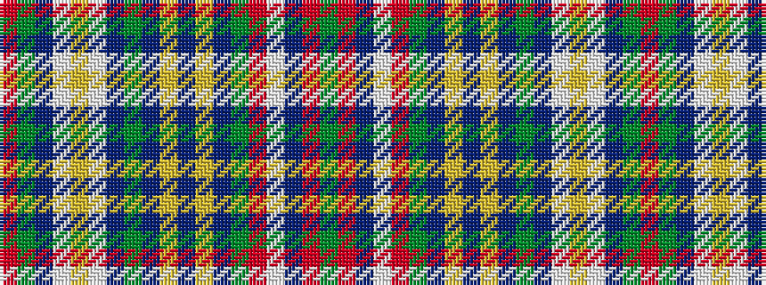

GRBWRGBYBYBGBWYWBGR

It is a 19 stripe tartan.

<figure class="pat-woven">

<figcaption>idealised sample</figcaption>
</figure>

## Colour Sequence



## Tartans with this colour sequence

| Tartans |
|---------------|
| [O'Kelly Family (Personal)](/setts/s19/dg28r12db1w2r1dg4db20lo2db3lo2db3dg7db3w1lo2w1db20dg4r12~x2/)|
||
