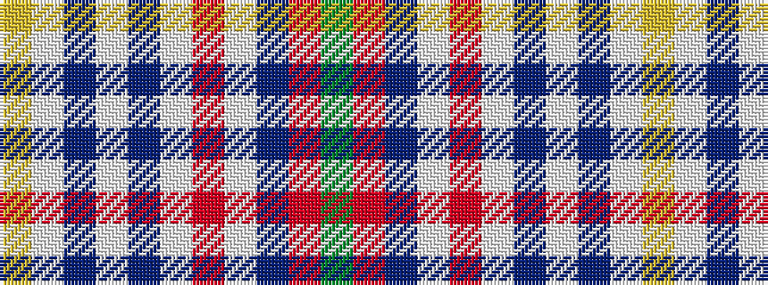

GRBWRWBWBWY

It is a 11 stripe tartan.

<figure class="pat-woven">

<figcaption>idealised sample</figcaption>
</figure>

## Colour Sequence



## Tartans with this colour sequence

| Tartans |
|---------------|
| [Texas Blue Bonnet](/variants/s11/g5r1db10w1r1w1t10w1t10w1ly1~x4/)|
||
| [Texas Bluebonnet District Tartan](/variants/s11/g4r1db8w1r1w1t8w1t8w1ly1~x4/)|
||
| [Texas, Bluebonnet](/variants/s11/g4r1db8w1r1w1b8w1b8w1ly1~x4/)|
||
