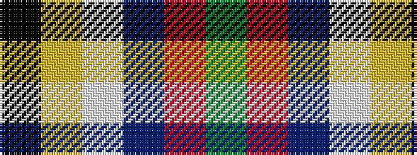

GRBWYK

It is a 6 stripe tartan.

<figure class="pat-woven">

<figcaption>idealised sample</figcaption>
</figure>

## Colour Sequence



## Tartans with this colour sequence

| Tartans |
|---------------|
| [Atlantic Police Academy](/setts/s6/k33ly4w3db33r2dg2~x2/)|
||
| [Atlantic Police Academy (Corporate)](/setts/s6/k33ly4w3db33r2g2~x2/)|
||
