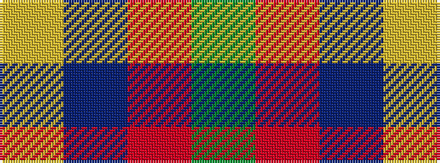

GRBY

It is a 4 stripe tartan.

<figure class="pat-woven">

<figcaption>idealised sample</figcaption>
</figure>

## Colour Sequence



## Tartans with this colour sequence

| Tartans |
|---------------|
| [Englehart](/setts/s4/g53r13db2ly22~x2/)|
||
| [Englehart, City of](/setts/s4/dg27r9n2ly14~x4/)|
||
