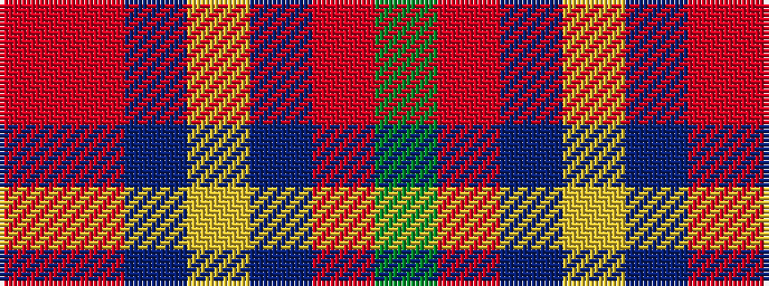

GRBYBRR

It is a 7 stripe tartan.

<figure class="pat-woven">

<figcaption>idealised sample</figcaption>
</figure>

## Colour Sequence



## Tartans with this colour sequence

| Tartans |
|---------------|
| [Krifa-Jean (Personal)](/setts/s7/dg4r5db4ly4do2o4r4~x5/)|
||
