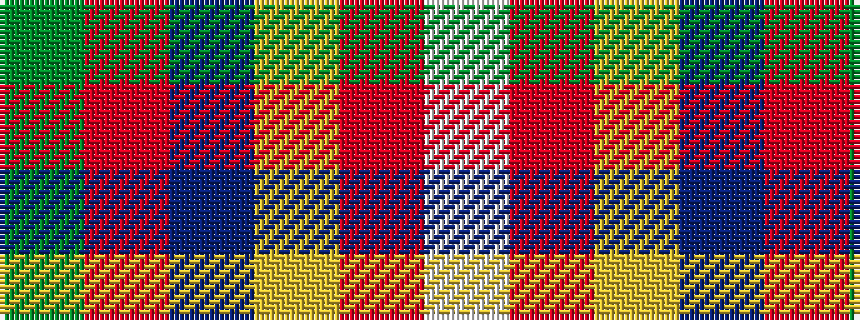

GRBYRW

It is a 6 stripe tartan.

<figure class="pat-woven">

<figcaption>idealised sample</figcaption>
</figure>

## Colour Sequence



## Tartans with this colour sequence

| Tartans |
|---------------|
| [Ryan/Fehder (Personal)](/setts/s6/w4r7lo5b13o18dg3~x2/)|
||
| [Ryan/Fehder (Personal)](/setts/s6/w4r7lo5b13r18g3~x2/)|
||
