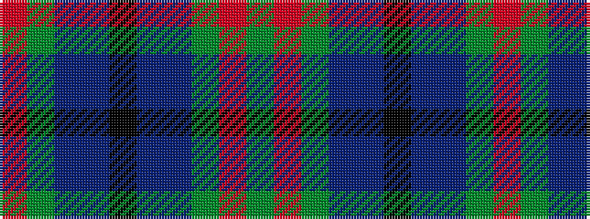

GRGBBKBBGR

It is a 10 stripe tartan.

<figure class="pat-woven">

<figcaption>idealised sample</figcaption>
</figure>

## Colour Sequence



## Tartans with this colour sequence

| Tartans |
|---------------|
| [Wilson's No.183](/setts/s10/r1g6dp6t1k2t1dp6g6r1g1~x4/)|
||
