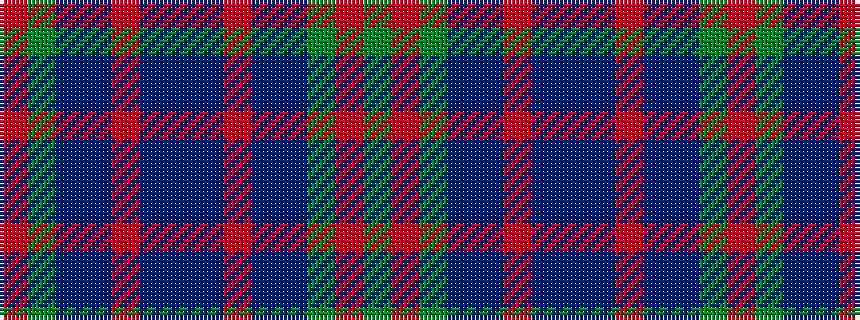

GRGBBRBBBRBBGR

It is a 14 stripe tartan.

<figure class="pat-woven">

<figcaption>idealised sample</figcaption>
</figure>

## Colour Sequence



## Tartans with this colour sequence

| Tartans |
|---------------|
| [Grampian](/setts/s14/y24r2y3db14dt24r2dt3db3~x2/)|
||
