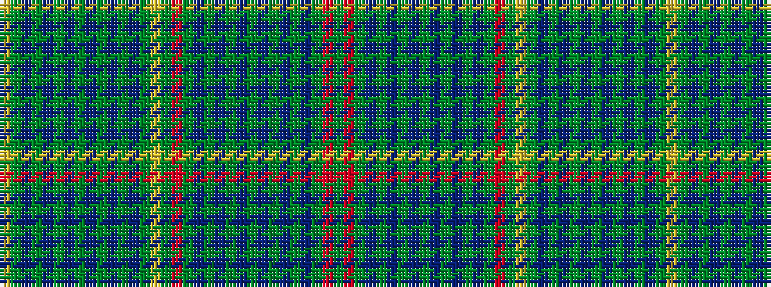

GRGBGBGBGBGBGBGRGYGBGBGBGBGBGBGY

It is a 32 stripe tartan.

<figure class="pat-woven">

<figcaption>idealised sample</figcaption>
</figure>

## Colour Sequence



## Tartans with this colour sequence

| Tartans |
|---------------|
| [Summers Family Tartan](/variants/s32/dg10r5dg42db16g5db5g5db5g36db5g5db5g5db16dg42r5dg10ly5dg42db16g5db5g5db5g36db5g5db5g5db16dg42ly5/)|
||
