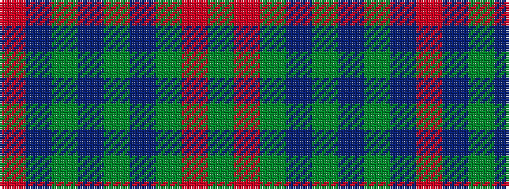

GRGBGBGBR

It is a 9 stripe tartan.

<figure class="pat-woven">

<figcaption>idealised sample</figcaption>
</figure>

## Colour Sequence



## Tartans with this colour sequence

| Tartans |
|---------------|
| [Barnaby Brown Pibroch](/setts/s9/dg2r1dg8db2dg1db2dg1db10r2~x4/)|
||
| [Brown, Barnaby (Personal)](/setts/s9/r2db10g1db2g1db2g8r1g2~x4/)|
||
