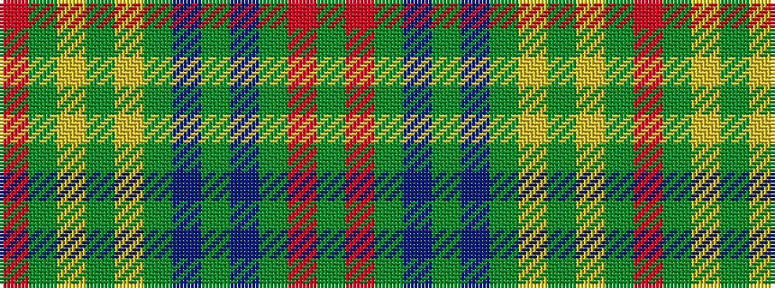

GRGBGBGYGYGR

It is a 12 stripe tartan.

<figure class="pat-woven">

<figcaption>idealised sample</figcaption>
</figure>

## Colour Sequence



## Tartans with this colour sequence

| Tartans |
|---------------|
| [O'Brien](/setts/s12/ri13g6ly2g3ly2g6t3g2t3g12r3g6~x2/)|
||
