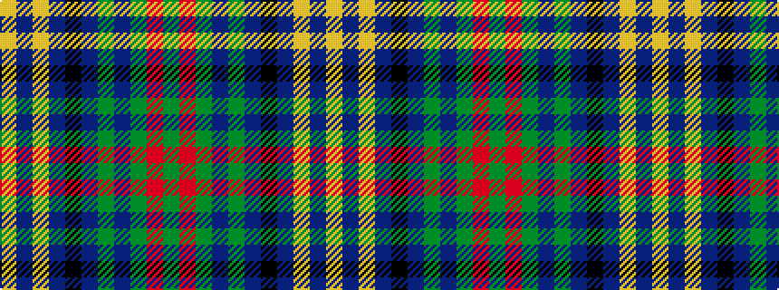

GRGBGBKBYBY

It is a 11 stripe tartan.

<figure class="pat-woven">

<figcaption>idealised sample</figcaption>
</figure>

## Colour Sequence



## Tartans with this colour sequence

| Tartans |
|---------------|
| [Boyle Family, Susan (Personal)](/variants/s11/g9r6g40dp6g6dp6k6dp36ly4dp8ly4/)|
||
