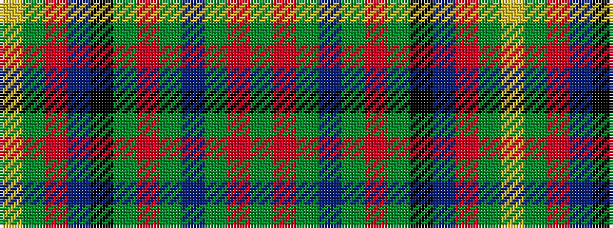

GRGBGRGKBRGY

It is a 12 stripe tartan.

<figure class="pat-woven">

<figcaption>idealised sample</figcaption>
</figure>

## Colour Sequence



## Tartans with this colour sequence

| Tartans |
|---------------|
| [Blaylock Hunting (Name)](/setts/s12/dg4o2dg8do8y2o8y16k2do5o2y5lo2~x2/)|
||
