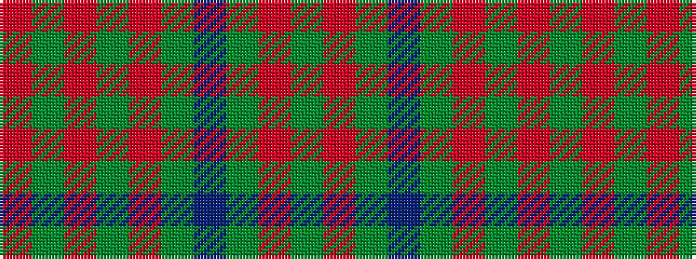

GRGBGRGRGR

It is a 10 stripe tartan.

<figure class="pat-woven">

<figcaption>idealised sample</figcaption>
</figure>

## Colour Sequence



## Tartans with this colour sequence

| Tartans |
|---------------|
| [Owen (Welsh Name)](/variants/s10/g3r1g2db1g3r3g2r2g18r2~x2/)|
||
