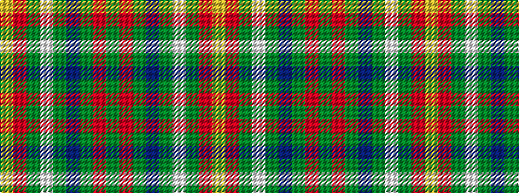

GRGBGWGRY

It is a 9 stripe tartan.

<figure class="pat-woven">

<figcaption>idealised sample</figcaption>
</figure>

## Colour Sequence



## Tartans with this colour sequence

| Tartans |
|---------------|
| [Teallach (Personal)](/setts/s9/lo4o24dy19w3y23n13dy3oi13dy3~x2/)|
||
