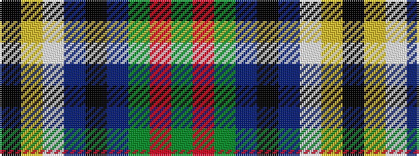

GRGBKBWYK

It is a 9 stripe tartan.

<figure class="pat-woven">

<figcaption>idealised sample</figcaption>
</figure>

## Colour Sequence



## Tartans with this colour sequence

| Tartans |
|---------------|
| [Dodd of Branford](/setts/s9/g4r2g20db8k8db4lb1lo2k1~x2/)|
||
