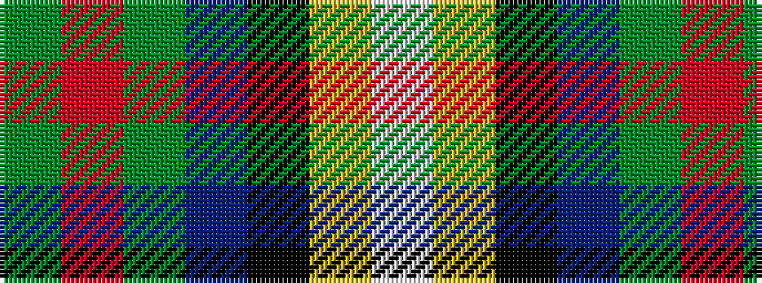

GRGBKYW

It is a 7 stripe tartan.

<figure class="pat-woven">

<figcaption>idealised sample</figcaption>
</figure>

## Colour Sequence



## Tartans with this colour sequence

| Tartans |
|---------------|
| [Decatur Presbyterian Church](/variants/s7/g41r6g12db8k2ly5w8~x2/)|
||
