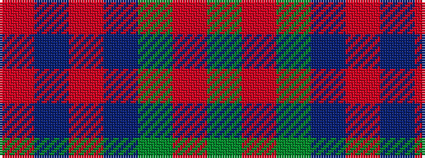

GRGBRBR

It is a 7 stripe tartan.

<figure class="pat-woven">

<figcaption>idealised sample</figcaption>
</figure>

## Colour Sequence



## Tartans with this colour sequence

| Tartans |
|---------------|
| [Robertson of Struan](/setts/s7/r6db2r2db21dg20r4dg4~x2/)|
||
| [Robertson of Struan](/setts/s7/r6db2r2db21g20r4g4~x2/)|
||
