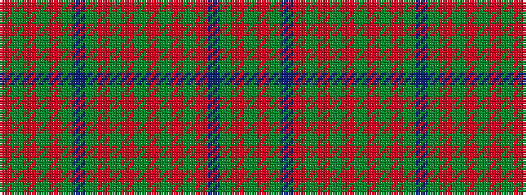

GRGBRGRGRGRGRGBGRGRGR

It is a 21 stripe tartan.

<figure class="pat-woven">

<figcaption>idealised sample</figcaption>
</figure>

## Colour Sequence



## Tartans with this colour sequence

| Tartans |
|---------------|
| [Matheson Hunting (STS incomplete sett)](/setts/s21/r8dg3r1dg1r1dg22db8dg3r1dg1r1dg3r6dg1r1dg1r2db6dg5r3dg4~x2/)|
||
| [Matheson, hunting](/setts/s21/r8g3r1g1r1g22db8g3r1g1r1g3r6g1r1g1r2db6g5r3g4~x2/)|
||
