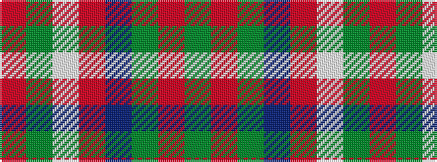

GRGBRWGR

It is a 8 stripe tartan.

<figure class="pat-woven">

<figcaption>idealised sample</figcaption>
</figure>

## Colour Sequence



## Tartans with this colour sequence

| Tartans |
|---------------|
| [McGirr (Letterkenny) David, (Pers.)](/setts/s8/g4r1g15t5r1w5g4r1~x4/)|
||
