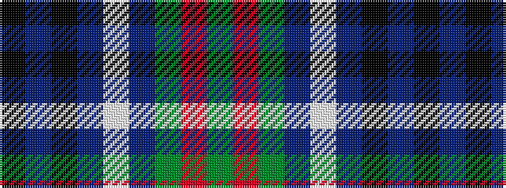

GRGBWBKBK

It is a 9 stripe tartan.

<figure class="pat-woven">

<figcaption>idealised sample</figcaption>
</figure>

## Colour Sequence



## Tartans with this colour sequence

| Tartans |
|---------------|
| [Cailleach](/setts/s9/k30db20k10db5w2db10g20r2g10/)|
||
| [Cailleach (Fashion)](/setts/s9/k30n20k10n5w2n10g20r2g10/)|
||
