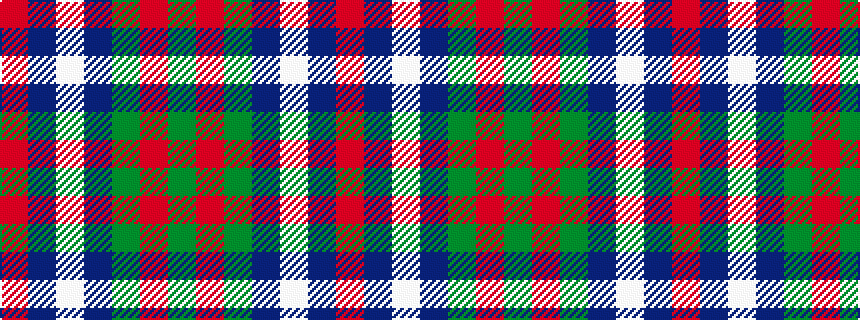

GRGBWBR

It is a 7 stripe tartan.

<figure class="pat-woven">

<figcaption>idealised sample</figcaption>
</figure>

## Colour Sequence



## Tartans with this colour sequence

| Tartans |
|---------------|
| [Brough (Name)](/variants/s7/r18db12w2db12dg8r3dg10~x2/)|
||
| [Sinclair Green (Personal)](/variants/s7/r4db15w2n15g30r2g4~x2/)|
||
