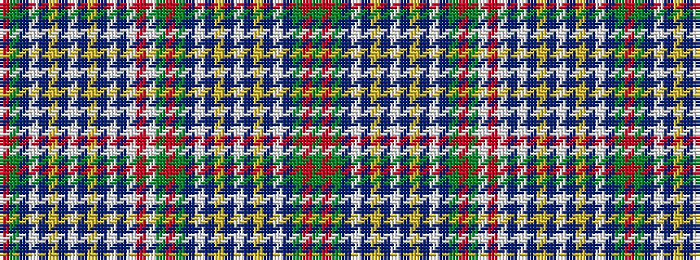

GRGBWBYBWBYBWBGRGWRWBWBYBWBYBWBGR

It is a 33 stripe tartan.

<figure class="pat-woven">

<figcaption>idealised sample</figcaption>
</figure>

## Colour Sequence



## Tartans with this colour sequence

| Tartans |
|---------------|
| [Hawick Corporate District Tartan](/variants/s33/dg24r2dg12dt2w2dt3ly2dt3lb4dt3ly2dt3w2dt2g12r2g12lb12r2lb12dt2w2dt3ly2dt3lb4dt3ly2dt3w2dt2dg12r2~x2/)|
||
