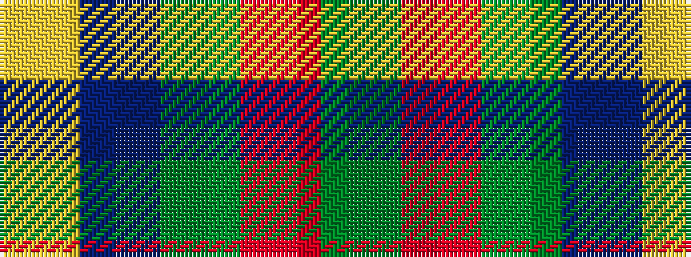

GRGBY

It is a 5 stripe tartan.

<figure class="pat-woven">

<figcaption>idealised sample</figcaption>
</figure>

## Colour Sequence



## Tartans with this colour sequence

| Tartans |
|---------------|
| [Gracie](/setts/s5/g47r3g6db35ly3~x2/)|
||
| [Gracie (Name)](/setts/s5/g47r3g6db35lo3~x2/)|
||
