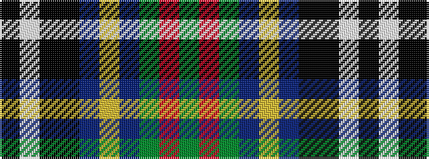

GRGBYBKKWK

It is a 10 stripe tartan.

<figure class="pat-woven">

<figcaption>idealised sample</figcaption>
</figure>

## Colour Sequence



## Tartans with this colour sequence

| Tartans |
|---------------|
| [Webster](/setts/s10/g32r3dy12b3ly3b3k24k24lb2k4~x2/)|
||
