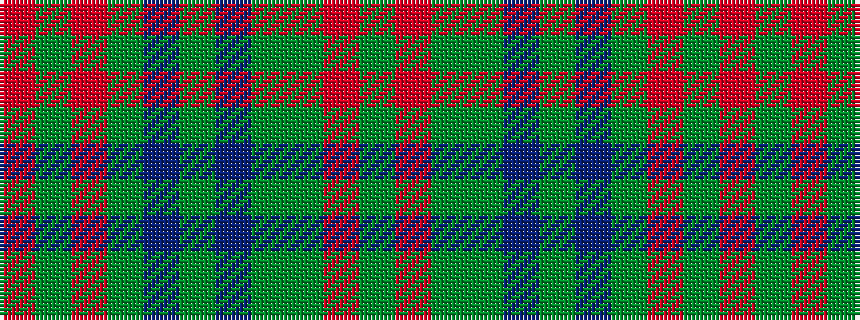

GRGGBGBGRGR

It is a 11 stripe tartan.

<figure class="pat-woven">

<figcaption>idealised sample</figcaption>
</figure>

## Colour Sequence



## Tartans with this colour sequence

| Tartans |
|---------------|
| [University Plaid](/variants/s11/dg4r1dg3y1db3y1db3y1r4dg3r4~x2/)|
||
