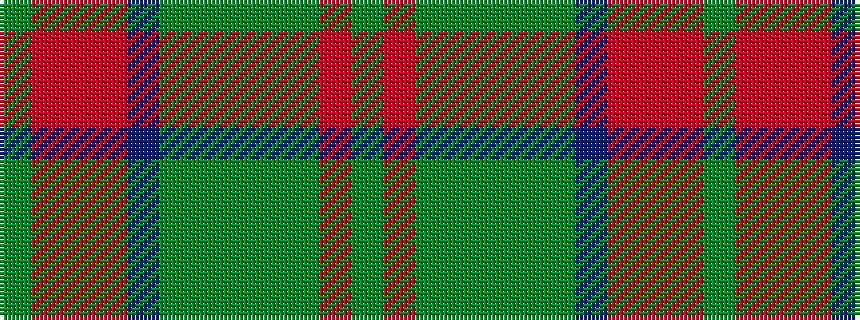

GRGGGGGBRRRG

It is a 12 stripe tartan.

<figure class="pat-woven">

<figcaption>idealised sample</figcaption>
</figure>

## Colour Sequence



## Tartans with this colour sequence

| Tartans |
|---------------|
| [Harmony 5](/variants/s12/dg9r3dg4dy3dg3dy4dg3dp11o30r3o4dg3~x2/)|
||
