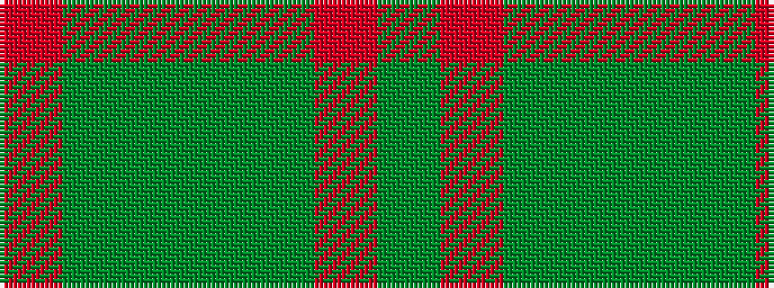

GRGGGGR

It is a 7 stripe tartan.

<figure class="pat-woven">

<figcaption>idealised sample</figcaption>
</figure>

## Colour Sequence



## Tartans with this colour sequence

| Tartans |
|---------------|
| [Ballantrae (Dalgety)](/variants/s7/dy5r3dy31dg20dy3g22r5~x2/)|
||
| [Ballintrae Trade Tartan](/variants/s7/dy10r5dy62dg40dy5g44r10/)|
||
