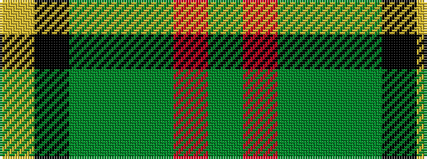

GRGGGKY

It is a 7 stripe tartan.

<figure class="pat-woven">

<figcaption>idealised sample</figcaption>
</figure>

## Colour Sequence



## Tartans with this colour sequence

| Tartans |
|---------------|
| [MacSween Hunting (Lochs, Isle of Lew](/setts/s7/g3r3g31dg18g4k22ly3/)|
||
| [MacSween Hunting (Lochs, Isle of Lewis) (Personal)](/setts/s7/dg3r3dg31dg18dg4k22lo3/)|
||
