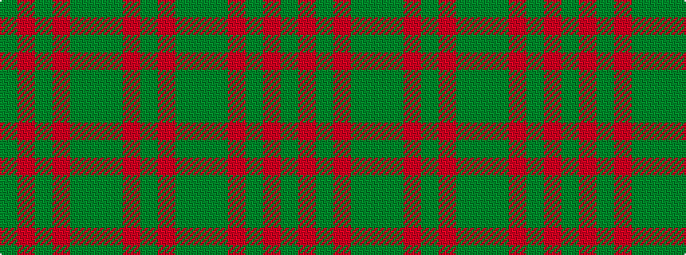

GRGGGRGRG

It is a 9 stripe tartan.

<figure class="pat-woven">

<figcaption>idealised sample</figcaption>
</figure>

## Colour Sequence



## Tartans with this colour sequence

| Tartans |
|---------------|
| [MacNaughton Htg](/variants/s9/dg1r1dgi22dy21dg12r11dgi22r1dg1~x2/)|
||
