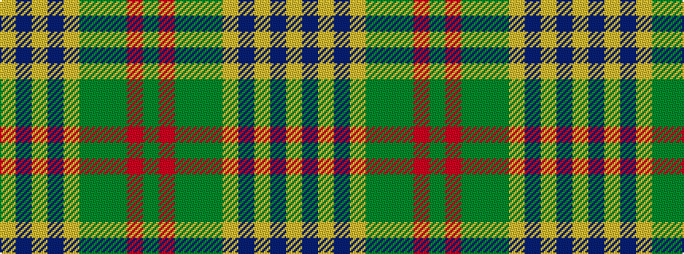

GRGGGYBYBY

It is a 10 stripe tartan.

<figure class="pat-woven">

<figcaption>idealised sample</figcaption>
</figure>

## Colour Sequence



## Tartans with this colour sequence

| Tartans |
|---------------|
| [Lodge Isandlwana](/variants/s10/dg40r8dg26g5dg10ly3db4ly2db1ly16~x2/)|
||
